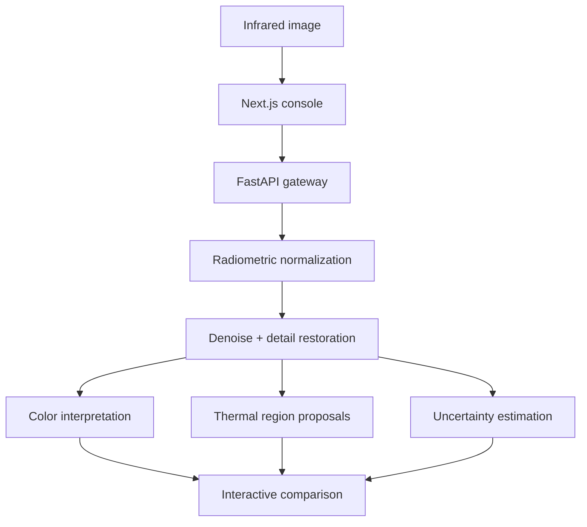

# IRIS — Infrared Interpretation Suite

IRIS is an end-to-end platform for infrared image restoration, perceptual colorization, uncertainty visualization, and thermal-region interpretation. It is designed for the **Infrared Image Colorization and Enhancement for Improved Object Interpretation** problem statement in the Bharatiya Antariksh Hackathon 2026.

The system combines a deterministic restoration baseline that runs immediately with a trainable residual U-Net for paired infrared-to-visible reconstruction. Every output is explicitly presented as an interpretation aid rather than recovered ground-truth visible color.

## What is implemented

- Interactive Next.js operations console with image upload and a built-in reference scene
- Synchronized before/after inspection slider
- Thermal, inferno, viridis, and monochrome visualization maps
- Robust intensity normalization, denoising, contrast restoration, gamma correction, and detail recovery
- Thermal anomaly region proposals with confidence scores
- Per-pixel uncertainty visualization
- Entropy, contrast, sharpness, edge-density, and dynamic-range metrics
- FastAPI inference API with validated controls and 25 MB upload protection
- Trainable residual U-Net, paired-image dataset loader, mixed-precision training loop, checkpointing, and ONNX export
- Containerized two-service development and deployment
- Automated backend tests and GitHub Actions quality gates

## System architecture



The lightweight deterministic pipeline is the default inference path. The `ml/` package provides the learned reconstruction path for experiments with aligned infrared and visible-spectrum training data.

## Quick start

### Docker Compose

```bash
docker compose up --build
```

Open:

- Web application: `http://localhost:3000`
- API documentation: `http://localhost:8000/docs`
- Health endpoint: `http://localhost:8000/health`

### Local development

Requirements:

- Node.js 20 or newer
- Python 3.11 or newer

```bash
npm install
python -m venv .venv
source .venv/bin/activate
pip install -r services/inference/requirements-dev.txt
```

Start the API:

```bash
cd services/inference
uvicorn app.main:app --reload
```

Start the web application in another terminal:

```bash
npm run dev
```

## API example

```bash
curl -X POST http://localhost:8000/v1/analyze \
  -F "file=@thermal-frame.tif" \
  -F "color_map=thermal" \
  -F "denoise_strength=38" \
  -F "detail_strength=62" \
  -F "gamma=0.92" \
  -F "hotspot_percentile=91"
```

The response contains three PNG data URIs, normalized region coordinates, input/output metrics, source metadata, and a mandatory interpretation disclosure.

## Training the colorization model

Prepare aligned images with matching filename stems:

```text
dataset/
├── infrared/
│   ├── frame_0001.png
│   └── frame_0002.png
└── visible/
    ├── frame_0001.png
    └── frame_0002.png
```

Then run:

```bash
pip install -r ml/requirements.txt
python -m ml.train \
  --data dataset \
  --output outputs/training \
  --epochs 80 \
  --batch-size 8
```

Export the best checkpoint:

```bash
python -m ml.export_onnx \
  --checkpoint outputs/training/best.pt \
  --output models/iris-colorizer.onnx
```

The training objective combines Smooth L1 reconstruction with structural similarity. Validation uses a deterministic split and tracks PSNR while retaining both latest and best checkpoints.

## Evaluation

Run the deterministic pipeline tests:

```bash
make test
```

For a trained reconstruction model, report:

| Dimension | Metrics |
|---|---|
| Reconstruction fidelity | PSNR, SSIM |
| Perceptual similarity | LPIPS, FID |
| Enhancement quality | Entropy, contrast, edge preservation |
| Interpretation utility | Detector mAP before vs. after enhancement |
| Calibration | Error–uncertainty correlation, expected calibration error |
| Runtime | Median and p95 latency by image resolution |

Evaluation should be split by geography, time of day, sensor, weather, and scene category to reveal domain-shift failures.

## Responsible interpretation

Single-band infrared imagery does not contain enough information to recover scientifically exact visible-spectrum color. A plausible colorization can improve human interpretation while still being wrong about material or object color.

IRIS therefore:

- labels outputs as perceptual interpretations;
- keeps the source image available at all times;
- estimates and displays uncertainty;
- avoids assigning semantic object names without a validated detector;
- reports image-quality changes rather than presenting enhancement as proof of correctness.

See [docs/MODEL_CARD.md](docs/MODEL_CARD.md) for intended use, limitations, and evaluation requirements.

## Repository layout

```text
.
├── apps/web/                 Next.js analysis console
├── services/inference/       FastAPI service and deterministic pipeline
├── ml/                       Residual U-Net training and ONNX export
├── docs/                     Architecture, data, and model documentation
├── .github/workflows/        Continuous integration
└── docker-compose.yml        Complete local stack
```

## License

Released under the [MIT License](LICENSE).
